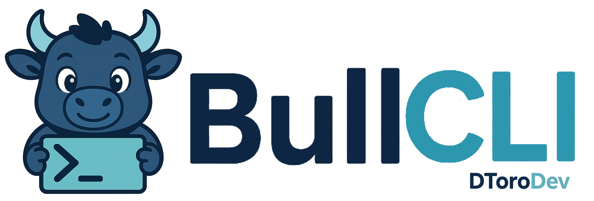
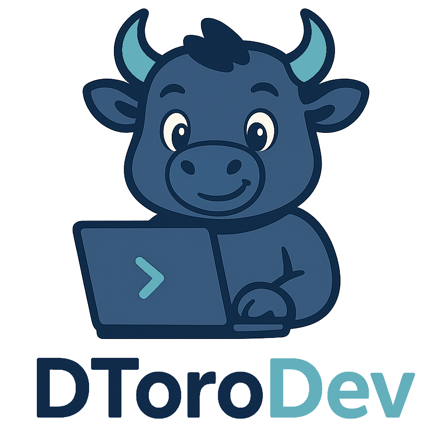

<div align="center">
  

  # 

  [](https://www.typescriptlang.org/)
  [](https://nodejs.org/)
  [](https://expressjs.com/)
  [](https://www.prisma.io/)
  [](https://sqlite.org/)
  

  
  
  
  
</div>

**BullCLI** es un instalador y herramienta de línea de comandos (CLI), creada en Rust, diseñada para trabajar en conjunto con el framework [**Bullwork**](https://www.npmjs.com/package/bullwork).

Te permite **crear proyectos backend en segundos**, administrar módulos, y manejar todo el flujo de desarrollo de una manera simple, eficiente y profesional.

## 🚀 ¿Qué es BullCLI?

BullCLI es la forma más rápida y moderna de construir backends profesionales usando Bullwork.Inspirada en la simplicidad de NestJS CLI, pero potenciada por el rendimiento de Rust.

- Creación instantánea de proyectos base.

- Generación de módulos organizados (generate:module).

- Ejecución de servidores de desarrollo (dev).

- Administración de bases de datos SQLite y Prisma (prisma, seed).

- Instalación y desinstalación de dependencias (install, uninstall).

## 📦 Instalación

Puedes descargar el instalador desde aquí:

👉 [Descargar BullCLI](https://github.com/dtoro-dev/bullcli-site/releases/download/v2.0.0/bullcli-installer.exe)

Una vez instalado, puedes comenzar a utilizar bull en tu terminal.

## 📚 Documentación

Consulta la documentación oficial para aprender todos los comandos disponibles:

👉 [Documentación BullCLI]()

## ⚙️ Comandos principales
<table style="width: 100%">
<thead>
<tr>
<th>
Comando
</th>
<th>
Descripción
</th>
</tr>
</thead>
<tbody>
<tr>
  <td> 
    <code>bull new</code>
  </td>
  <td>Crear un nuevo proyecto Bullwork.</td>
</tr>
<tr>
  <td><code>bull dev</code></td>
  <td>Levantar el servidor de desarrollo.</td>
</tr>
<tr>
  <td><code>bull generate:module <nombre></code></td>
  <td>Crear un nuevo módulo (controlador, servicio, DTO, etc.).</td>
</tr>
<tr>
  <td><code>bull remove:module <nombre></code></td>
  <td>Elimina un módulo (controlador, servicio, DTO, etc.).</td>
</tr>
<tr>
  <td><code>bull install <paquete></code></td>
  <td>Instalar nuevas dependencias en el proyecto.</td>
</tr>
<tr>
  <td><code>bull uninstall <paquete></code></td>
  <td>Eliminar dependencias del proyecto.</td>
</tr>
<tr>
  <td><code>bull prisma init</code></td>
  <td>Inicializar Prisma y la base de datos SQLite.</td>
</tr>
<tr>
  <td><code>bull prisma migrate-dev</code></td>
  <td>Ejecutar migraciones en ambiente de desarrollo.</td>
</tr>
<tr>
  <td><code>bull prisma migrate-prod</code></td>
  <td>Ejecutar migraciones para producción.</td>
</tr>
<tr>
  <td><code>bull seed</code></td>
  <td>Ejecutar archivos de seed para poblar datos iniciales.</td>
</tr>
<tr></tr>
</tbody>
</table>

## 🛠️ Requisitos

- Node.js 18 o superior.
- pnpm instalado globalmente (recomendado).
- Sistema operativo: Windows 10/11 (versión Linux/Mac en preparación).
- Prisma instalado como dependencia del proyecto (Bullwork CLI lo maneja automáticamente).

## 🔄 Instalación

Descargar e instalar [**BullCLI**](https://github.com/dtoro-dev/bullcli-site/releases/download/v2.0.0/bullcli-installer.exe).

🔄 Comandos disponibles

### Crear proyecto
```
bull new            # Crea un nuevo proyecto Bullwork
bull new project-name  # Crea un proyecto con nombre
```
### Desarrollo
```
bull dev            # Levanta el servidor de desarrollo
```
### Instalación de paquetes
```
bull install package-name    # Instala uno o varios paquetes
bull i package-name          # Alias de install
bull uninstall package-name  # Elimina paquetes
```
### Prisma (ORM)
```
bull prisma init          # Inicializa Prisma y crea base de datos
bull prisma validate      # Valida el schema de Prisma
bull prisma generate      # Genera el cliente de Prisma
bull prisma migrate-dev   # Aplica migraciones en entorno de desarrollo
bull prisma migrate-prod  # Aplica migraciones en entorno de producción
```
### Generar o eliminar módulos
```
bull generate:module module-name   # Crea un módulo completo
bull g:m module-name               # Alias
```
```
bull remove:module module-name     # Elimina un módulo
bull r:m module-name               # Alias
```
### Ejecutar cualquier script
```
bull run script-name [args]
# Ejemplo: bull run prisma:generate
```
### Seeds
```
bull seed           # Ejecuta los seeds de la base de datos
```
## 🔄 Estructura de proyecto generada
```
<nombre-proyecto>/
├── config/
│   ├── env.development
│   ├── env.production
│   └── env.test
├── src/
│   ├── app/
│   ├── orm/
│   │   ├── schema.prisma
│   │   └── seed.ts
│   ├── tests/
│   ├── environment.config.ts
│   └── main.ts
├── .gitignore
├── global.d.ts
├── package.json
├── tsconfig.json
└── README.md
```
## 📊 Beneficios

- **Ultra rápido:** Rust garantiza ejecución en milisegundos.

- **Ergonomía:** Comandos simples de recordar.

- **Organizado:** Seguimos el estándar de Bullwork para escalar proyectos fácilmente.

- **Automatizado:** Crea carpetas, archivos y configuraçón en segundos.

- **Listo para Producción:** Directamente orientado al backend profesional.

## 🚀 Sobre Bullwork

Bullwork es un framework backend moderno construido en TypeScript, pensado para ser minimalista pero poderoso, ideal para proyectos profesionales y escalables.

**BullCLI es su CLI oficial a partir de la versión 2.0.0.**

## 🛡️ Licencia

Este proyecto está protegido bajo la licencia propietaria:

© 2025 Diego Toro | DToroDev - Todos los derechos reservados. Prohibida la reproducción, distribución o copia sin autorización.

# 🐂 BullCLI - ¡Crea proyectos backend como un verdadero profesional! 🚀

<div align="center">
  <a href="https://dtoro-dev-portfolio.netlify.app/">
    
  </a> 
</div>